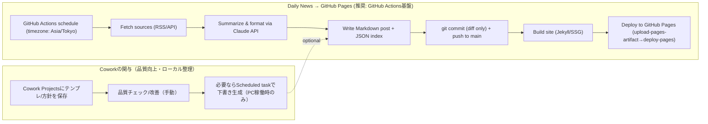

# Claude Cowork活用の実践レポート

## エグゼクティブサマリ

Claude Coworkは、デスクトップ上で「タスクを渡すと、ローカルファイルやコネクタ等にアクセスしながら作業し、成果物を返す」タイプの機能群で、特に**定型業務の自動化（Scheduled tasks）**と、作業コンテキストを束ねる**プロジェクト（Projects）**が中核です。Scheduled tasksは「同じ指示を繰り返し実行する」目的に合致しますが、**PCが起動中かつClaude Desktopが開いている時だけ動く**という制約があり、サーバー系の堅牢な定期実行には不向きです。citeturn30view0turn3view0turn4view3

したがって、あなたの要件（デイリーニュースを定期取得→GitHubへPush→GitHub Pagesで公開）については、**定期実行の“背骨”をGitHub Actions**に置き、**Claude（API）を要約・整形・分類に使う**構成が最も運用安定します。GitHub PagesはActionsでのカスタムデプロイが公式に整理されており、`pages: write` と `id-token: write` など必要権限も明確です。citeturn24view0turn24view2turn16search3

一方でCoworkは、(1)プロンプトやテンプレートの設計・改善、(2)日記や成果物のファイル整理・タグ付け、(3)あなたの“クローン”運用（毎日の要約→知識化→参照）といった**ローカル中心のナレッジ運用**に強みがあります。とくにProjectsは「指示・ファイル・（製品側の）記憶」を束ねられますが、**プロジェクトデータがローカル保存でクラウド同期が無い**ため、クローンの再現性は“ファイルとしての自己記述（profile.md等）”で担保する設計が重要です。citeturn4view3

コスト面は、Claude APIのモデル単価（例：Haiku 4.5＝$1/$5 per MTok、Sonnet 4.6＝$3/$15 per MTok）と、必要ならWeb検索ツール（$10/1000検索）等のツール課金を組み合わせて見積もれます。Bulk処理や非緊急処理にはMessage Batches（標準の半額課金）が有効です。citeturn13view2turn25view0turn20view4

---

## Claude Coworkの公式仕様と設計上のポイント

Claude Coworkはentity["company","Anthropic","ai company, us"]が提供するデスクトップ中心の機能で、通常チャットとは別に「Coworkタスク」を作って実行し、成果物（レポート、要約、ファイル等）を受け取る設計です。Coworkの会話履歴はローカル保存で、監査ログやデータエクスポート等の対象外と明記されているため、企業コンプライアンス用途には注意が必要です。citeturn1view0turn3view0

Scheduled tasks（定期タスク）は、Cowork上のタスクを**毎日・毎週などの間隔で自動実行**する仕組みで、「一度指示を書けば、毎回成果物を返す」用途に向きます。Scheduled tasksは、通常のCoworkタスク同様にコネクタやSkills、プラグインへアクセスでき、例としてSlack/メール/カレンダーの24時間要約や定期的なリサーチなどが挙げられています。citeturn30view0turn12view0

ただし、Scheduled tasksには運用上致命的になり得る制約があります。**PCがスリープ中、あるいはClaude Desktopが閉じていると実行されず、後でまとめて再実行される**（スキップ履歴も残る）ため、時刻厳密性が要るワークロード（例：毎朝必ず公開更新）はGitHub Actions等のクラウド実行に比べ不安定です。citeturn30view0

Projectsは、タスクや関連ファイルを“作業スペース”としてまとめる機能ですが、**デスクトップ限定でプロジェクトデータのクラウド同期が無い**とされています。さらに「既存フォルダをプロジェクトに紐づける」などは可能でも、Cowork側の内部状態（記憶等）がファイルとして自動エクスポートされる保証がありません。よって「クローン」を再現可能にするには、**あなたの方針・嗜好・経歴・判断基準を“ファイルに書く”**（後述）設計が重要です。citeturn4view3turn30view0

料金体系としては、ClaudeのProプランに「Coworkが含まれる」と明記され、月額価格帯も提示されています（Team/Enterprise等の上位枠も別に存在）。APIは別建てでトークン課金とツール課金が提示されています。citeturn13view2turn12view0

---

## デイリーニュース取得からGitHub Pages公開までの自動化

### 推奨アーキテクチャ

結論として、**“確実に毎日更新される公開サイト”**を作るなら、実行基盤はentity["company","GitHub","code hosting platform"]のGitHub Actionsが第一候補です。理由は、(1)GitHub Pagesデプロイが公式アクションで整備されている、(2)cron相当のスケジュールがYAMLで宣言できる、(3)成果物をそのまま同一リポジトリへPushできる、という一体運用が可能だからです。citeturn24view0turn27view0turn16search3

Coworkはここに対して、次の役割が現実的です。
- 初期設計：ニュース要約のフォーマット、カテゴリ設計、テンプレ、プロンプトの洗練
- 手動検証：要約品質や見出し・リンク形式などのチェック、改善
- ローカル支援：必要なら（PC稼働時限定で）Scheduled tasksで下書きを作り、GitHub Actionsがそれを取り込む形に寄せる  
ただし「Coworkだけで毎日公開更新まで完結」は、前述の“PC稼働条件”のため、安定運用が難しい位置づけです。citeturn30view0turn3view0

### GitHub Actionsスケジューリングの注意点

GitHub Actionsの`schedule`は、負荷状況で**遅延**したり、キューの一部が**落ちる**可能性が公式に明記されています。毎時0分付近は高負荷になりやすいので、例えば「07:07」など“少しズラす”ほうが堅牢です。citeturn24view3turn27view0

2026年3月時点で、GitHub Actionsはスケジュールに**IANAタイムゾーンを指定**できるようになっています（`timezone: "Asia/Tokyo"`など）。これによりUTC換算の煩雑さを減らせます。citeturn29search16turn29search8turn29search5

### フォーマット設計（Markdown/JSON）とPages最適化

最小構成で運用するなら「Jekyllのポスト形式（Markdown＋front matter）」が最も手数が少ないです。GitHub Pagesはブランチ公開だとJekyllでビルドされるのがデフォルトで、他のSSGを使う場合はActionsビルドや`.nojekyll`利用が推奨されています。citeturn14search11turn16search3

ニュース要約は著作権・利用規約に抵触しないよう、**全文転載ではなく見出し＋短い要約＋リンク**を基本形にし、必要ならJSONでインデックス（タグ検索用）を別途生成して静的検索に使います。なお、Cowork（Dispatch含む）やCoworkの機能が外部サービスを扱う場合、誤操作やフィッシング等の安全上の注意が強調されています（自動化で“やり直しが難しい操作”をしない設計が重要）。citeturn30view1turn3view0

### ワークフロー図（mermaid）



### サンプル実装（リポジトリ構成例）

例として、次のように置きます（Jekyll前提、生成物は`_posts/`へ）。
- `_posts/YYYY-MM-DD-daily-news.md`（毎日のニュース）
- `scripts/news_digest.py`（Python）
- `scripts/news_digest.mjs`（Node/TypeScript系）
- `config/news_sources.json`（RSS等の入力定義）

### サンプルコード（Python：Claude APIで整形済みMarkdown本文を生成）

前提として、ClaudeのPython SDKは`pip install anthropic`で導入し、`ANTHROPIC_API_KEY`を環境変数で渡すのが公式例です。citeturn22view0turn20view5

```python
# scripts/news_digest.py
import os
import json
import datetime as dt
from pathlib import Path

import feedparser  # pip install feedparser
from anthropic import Anthropic  # pip install anthropic

JST = dt.timezone(dt.timedelta(hours=9))

def load_sources(path: str) -> list[dict]:
    return json.loads(Path(path).read_text(encoding="utf-8"))

def fetch_recent_items(feed_url: str, since: dt.datetime) -> list[dict]:
    """
    RSSから「それっぽく」新しいものを拾う（pubDateが無いフィードもあるため安全側）。
    """
    d = feedparser.parse(feed_url)
    items = []
    for e in d.entries[:50]:
        link = getattr(e, "link", "")
        title = getattr(e, "title", "").strip()
        summary = getattr(e, "summary", "").strip()
        published_parsed = getattr(e, "published_parsed", None)

        published = None
        if published_parsed:
            published = dt.datetime(*published_parsed[:6], tzinfo=dt.timezone.utc).astimezone(JST)

        if title and link:
            if (published is None) or (published >= since):
                items.append({
                    "title": title,
                    "url": link,
                    "published": published.isoformat() if published else None,
                    "summary": summary[:500],
                })
    return items

def build_prompt(date_str: str, items: list[dict], max_len: int = 40) -> str:
    # APIコスト抑制のため、入力を短く
    slice_items = items[:max_len]
    lines = []
    for i, it in enumerate(slice_items, 1):
        lines.append(f"{i}. {it['title']}\n   - url: {it['url']}\n   - published: {it['published']}\n   - hint: {it['summary']}")
    joined = "\n".join(lines)

    return f"""あなたは日本語のニュース編集者です。{date_str}の「デイリーニュース」をMarkdownで作ってください。

制約:
- 記事の全文転載は禁止。各項目は短い要約（最大3文）にする。
- それぞれに必ず出典リンクを付ける（Markdownリンク）。
- 誇張せず、事実/推測を区別する。
- 見出し: 「主要トピック」「気になる論点」「参考リンク」。
- 箇条書き中心で読みやすく。

素材（候補）:
{joined}
"""

def write_jekyll_post(out_path: Path, date: dt.date, body_md: str) -> None:
    front_matter = f"""---
layout: post
title: "Daily News Digest ({date.isoformat()})"
date: {date.isoformat()} 07:07:00 +0900
categories: [news]
tags: [daily, digest]
---
"""
    out_path.parent.mkdir(parents=True, exist_ok=True)
    out_path.write_text(front_matter + "\n" + body_md.strip() + "\n", encoding="utf-8")

def main() -> None:
    api_key = os.environ.get("ANTHROPIC_API_KEY")
    if not api_key:
        raise RuntimeError("ANTHROPIC_API_KEY is not set")

    model = os.environ.get("CLAUDE_MODEL", "claude-sonnet-4-6")
    today = dt.datetime.now(JST).date()
    since = dt.datetime.now(JST) - dt.timedelta(hours=24)

    sources = load_sources("config/news_sources.json")
    items: list[dict] = []
    for s in sources:
        items.extend(fetch_recent_items(s["feed_url"], since))

    # 重複除去（URL）
    seen = set()
    uniq = []
    for it in items:
        if it["url"] in seen:
            continue
        seen.add(it["url"])
        uniq.append(it)

    prompt = build_prompt(today.isoformat(), uniq)

    client = Anthropic(api_key=api_key)
    msg = client.messages.create(
        model=model,
        max_tokens=1200,
        messages=[{"role": "user", "content": prompt}],
    )

    # contentはブロック配列。テキストだけ抽出
    text_blocks = [b.text for b in msg.content if getattr(b, "type", None) == "text"]
    body_md = "\n".join(text_blocks).strip()

    out = Path(f"_posts/{today.isoformat()}-daily-news.md")
    write_jekyll_post(out, today, body_md)

if __name__ == "__main__":
    main()
```

### サンプルコード（Node.js：TypeScript SDKで同等の処理）

TypeScript/Node向け公式SDKは`npm install @anthropic-ai/sdk`で導入し、`ANTHROPIC_API_KEY`を用いて`client.messages.create(...)`する例が提示されています。citeturn26view0turn20view0

```javascript
// scripts/news_digest.mjs
import fs from "node:fs";
import path from "node:path";
import Parser from "rss-parser";
import Anthropic from "@anthropic-ai/sdk";

const JST_OFFSET_MIN = 9 * 60;

function jstNow() {
  const now = new Date();
  // DateはUTC基準で保持されるので、表示側だけJST寄せする簡易実装
  return new Date(now.getTime() + JST_OFFSET_MIN * 60_000);
}

function isoDateJST(d) {
  // YYYY-MM-DD
  const y = d.getUTCFullYear();
  const m = String(d.getUTCMonth() + 1).padStart(2, "0");
  const day = String(d.getUTCDate()).padStart(2, "0");
  return `${y}-${m}-${day}`;
}

function buildPrompt(dateStr, items) {
  const lines = items.slice(0, 40).map((it, idx) => {
    return `${idx + 1}. ${it.title}\n   - url: ${it.url}\n   - published: ${it.published}\n   - hint: ${it.summary?.slice(0, 300) ?? ""}`;
  }).join("\n");

  return `あなたは日本語のニュース編集者です。${dateStr}の「デイリーニュース」をMarkdownで作ってください。

制約:
- 全文転載は禁止。各項目は短い要約（最大3文）。
- 各項目に必ず出典リンク（Markdownリンク）。
- 事実/推測を区別。
- 見出し: 「主要トピック」「気になる論点」「参考リンク」。
- 箇条書き中心。

素材（候補）:
${lines}
`;
}

async function main() {
  const apiKey = process.env.ANTHROPIC_API_KEY;
  if (!apiKey) throw new Error("ANTHROPIC_API_KEY is not set");

  const model = process.env.CLAUDE_MODEL ?? "claude-sonnet-4-6";
  const today = jstNow();
  const dateStr = isoDateJST(today);

  const sources = JSON.parse(fs.readFileSync("config/news_sources.json", "utf-8"));
  const parser = new Parser();
  const sinceMs = Date.now() - 24 * 60 * 60 * 1000;

  const items = [];
  for (const s of sources) {
    const feed = await parser.parseURL(s.feed_url);
    for (const e of (feed.items ?? []).slice(0, 50)) {
      const url = e.link;
      const title = (e.title ?? "").trim();
      const pub = e.isoDate ? new Date(e.isoDate).getTime() : null;
      if (!url || !title) continue;
      if (pub === null || pub >= sinceMs) {
        items.push({
          title,
          url,
          published: e.isoDate ?? null,
          summary: (e.contentSnippet ?? e.content ?? "").toString(),
        });
      }
    }
  }

  // de-dup
  const seen = new Set();
  const uniq = [];
  for (const it of items) {
    if (seen.has(it.url)) continue;
    seen.add(it.url);
    uniq.push(it);
  }

  const prompt = buildPrompt(dateStr, uniq);

  const client = new Anthropic({ apiKey }); // 公式例と同形
  const message = await client.messages.create({
    model,
    max_tokens: 1200,
    messages: [{ role: "user", content: prompt }],
  });

  const body = (message.content ?? [])
    .filter((b) => b.type === "text")
    .map((b) => b.text)
    .join("\n")
    .trim();

  const frontMatter =
`---
layout: post
title: "Daily News Digest (${dateStr})"
date: ${dateStr} 07:07:00 +0900
categories: [news]
tags: [daily, digest]
---
`;

  const outPath = path.join("_posts", `${dateStr}-daily-news.md`);
  fs.mkdirSync(path.dirname(outPath), { recursive: true });
  fs.writeFileSync(outPath, frontMatter + "\n" + body + "\n", "utf-8");
}

main().catch((e) => {
  console.error(e);
  process.exit(1);
});
```

### サンプルGitHub Actions（定期実行→生成→差分があればPush→Pagesデプロイ）

GitHub Pagesのカスタムワークフローは`configure-pages`→`upload-pages-artifact`→`deploy-pages`の流れが公式に整理され、デプロイjobには`pages: write` と `id-token: write` などが必要です。citeturn24view0  
また、`GITHUB_TOKEN`は最小権限に絞るべきで、`permissions:`で制御可能です。citeturn24view2turn14search9

```yaml
# .github/workflows/daily-news.yml
name: daily-news

on:
  workflow_dispatch:
  schedule:
    - cron: "7 7 * * *"
      timezone: "Asia/Tokyo" # タイムゾーン指定が可能に（IANA）: 2026-03時点

concurrency:
  group: daily-news
  cancel-in-progress: false

jobs:
  build-content:
    runs-on: ubuntu-latest
    permissions:
      contents: write  # 生成物をコミットしてpushするため
    steps:
      - name: Checkout
        uses: actions/checkout@v4

      - name: Setup Python
        uses: actions/setup-python@v5
        with:
          python-version: "3.12"

      - name: Install deps
        run: |
          pip install --upgrade pip
          pip install anthropic feedparser

      - name: Generate daily news (Python)
        env:
          ANTHROPIC_API_KEY: ${{ secrets.ANTHROPIC_API_KEY }}
          CLAUDE_MODEL: claude-sonnet-4-6
        run: |
          python scripts/news_digest.py

      - name: Commit & push if changed
        run: |
          git status --porcelain
          if git diff --quiet; then
            echo "No changes; skip commit."
            exit 0
          fi
          git config user.name "github-actions[bot]"
          git config user.email "github-actions[bot]@users.noreply.github.com"
          git add _posts config || true
          git commit -m "chore: daily news $(date -u +%F)"
          git push

  deploy-pages:
    runs-on: ubuntu-latest
    needs: build-content
    permissions:
      contents: read
      pages: write
      id-token: write
    environment:
      name: github-pages
      url: ${{ steps.deployment.outputs.page_url }}
    steps:
      - name: Checkout
        uses: actions/checkout@v4

      - name: Configure Pages
        uses: actions/configure-pages@v5

      - name: Build with Jekyll
        uses: actions/jekyll-build-pages@v1
        with:
          source: .
          destination: ./_site

      - name: Upload artifact
        uses: actions/upload-pages-artifact@v4
        with:
          path: ./_site

      - name: Deploy
        id: deployment
        uses: actions/deploy-pages@v4
```

補足として、`schedule`は遅延やドロップの可能性があるため、「7:07」のように毎時ちょうどを避ける、障害時に手動実行できるよう`workflow_dispatch`を付ける、などが実務上の保険になります。citeturn24view3turn27view0turn24view0

---

## “クローン”用データ設計とCowork運用ワークフロー

### 目的を分解して設計する

「自分のクローン」は、一般に(1)あなたの方針・価値観・癖（長期記憶）、(2)直近の出来事・進行中の関心（短期記憶）、(3)アウトプットの型（テンプレ/手順）の3層に分かれます。CoworkのProjectsは文脈管理に役立ちますが、プロジェクト同期が無い以上、クローンの可搬性は**ファイルに落ちる設計**が鍵です。citeturn4view3turn30view1

### 推奨データ構造（Markdown＋Front matter＋インデックス）

以下は“Gitで持てる/検索しやすい/同期しやすい”を優先した構成例です。

- `profile/`：不変に近い自己定義（価値観、意思決定原則、文体、禁止事項）
- `journal/YYYY/YYYY-MM-DD.md`：日々の日記（事実・感情・学び・次アクション）
- `artifacts/`：成果物（企画書、メモ、設計、ログ）
- `strengths/christopher-strengths/`：あなたが呼ぶ「クリストファーストレングス」の成果物置き場（原文名称のまま）
- `index/`：タグ・検索用のJSON（静的サイト検索やRAG前処理に利用）

1ファイル1日を原則にすると、差分管理・復元・暗号化ポリシーが単純になります（後述のgit-crypt等とも相性が良い）。citeturn17search2turn4view3

日記テンプレ例（`journal/2026/2026-03-29.md`）：

```markdown
---
date: 2026-03-29
timezone: Asia/Tokyo
tags: [work, learning, health]
mood: calm
visibility: private   # private | public | redacted
sources: []           # 外部参照があればURL
---

## 事実ログ
- 

## 思考・学び
- 

## クリストファーストレングス成果
- 

## 明日やる
- 
```

この“visibility”のような属性は、後で「公開用に落とす」「クローン用に使うが公開しない」などの分岐を自動化しやすくします。GitHub Pages自体にも「公開/非公開」を切り替える機能がありますが、私的データはそもそも公開サイトに載せない前提で設計するほうが安全です。citeturn16search0turn16search16

### 同期方法とプライバシー管理

同期は原則Git（Private repo推奨）で、公開したい部分だけを別のPublic repoへ“抽出”する二段構えが事故に強いです。GitHub Pagesは有償プランでPrivate repoからの利用が可能である一方、Enterprise CloudではPagesのアクセス制御（Private公開）が可能など、プラン条件が絡みます。citeturn16search16turn16search0turn16search27

Private repoでも「ミスで秘密情報をコミットする」事故は起こり得るため、APIキー等は環境変数・Secretsで扱い、`.env`はコミットしない、という基本はClaude側の公式ガイダンスでも強調されています。citeturn20view5turn17search0

### Coworkで“クローン”を有効活用する運用

Cowork側では、次のように“プロジェクト化”すると日々の運用が回ります。

- Cowork Projectsに「clone-vault」フォルダ（上記構造）を紐づける  
- Projectsの指示（Instructions）には「このフォルダ構造を守る」「新しい学びはprofileに反映」「公開禁止」など運用規約を書く  
- 定例で回す処理はScheduled tasksにし、毎日/毎週で「日記の未整理→要約→タグ提案→index更新」を行う  

ただし、Scheduled tasksは**PC起動＆アプリ起動が必要**で、スキップ後に再実行される仕様です。したがって「毎晩の振り返り」など“多少ズレても良い”処理が適しています。citeturn30view0turn4view3

さらにDispatch（スマホから同一スレッドで指示→デスクトップで実行）は研究プレビューとして提供され、ファイル・コネクタ・プラグイン・computer useを連鎖させるため、誤操作・悪性コンテンツの影響が大きいと明確に警告されています。クローン運用でDispatchを使うなら、**触らせるフォルダを限定**し、“削除/送信/課金”につながる操作は極力避ける設計が実務的です。citeturn30view1turn3view0

### 「クリストファーストレングス」の扱い（原文維持＋解釈案）

ご指定の通り「クリストファーストレングス」は原文のまま扱います。その上で、運用設計上は“別の概念に寄せた整理”ができるよう、解釈候補を並べます。

- **解釈案A：CliftonStrengths（旧StrengthsFinder）の誤記**  
  Gallupの強み診断はStrengthsFinderからCliftonStrengthsへリブランドされた経緯が公式に説明されています。日本語でも「クリフトンストレングス」として提供されています。citeturn23search2turn23search0turn23search1
- 解釈案B：「Christopher Strengths」という独自フレーム（個人/組織内の呼称）  
  この場合は、成果物フォルダを固定し、定義（何を測る/どう活かす/出典）を`strengths/definition.md`として明文化すると、クローン側が参照しやすくなります。
- 解釈案C：人物名（Christopher）＋強み分析のログ（コーチング/研修のメモ）  
  機微情報が混じる可能性が高いので、`visibility: private`と暗号化対象ディレクトリに寄せる運用が無難です。  

---

## セキュリティ・プライバシー・コスト見積

### 認証・権限管理（Claude API / Workspaces / GitHub）

Claude APIキーは「クレジットカード級の秘密情報」で、漏洩すれば第三者が課金を発生させ得るため、環境変数・暗号化シークレットで扱い、定期ローテーションや用途別キー分離が推奨されています。citeturn20view5turn18search5

チーム運用では、Claude APIのWorkspacesを使うと、APIキーをワークスペースにスコープし、役割（User/Developer/Admin等）や利用制限・コスト管理を分離できます。Admin APIキー（`sk-ant-admin...`）が別物である点も明記されています。citeturn10view0turn18search19

GitHub側は、`GITHUB_TOKEN`の権限を`permissions:`で絞ることが推奨され、Pagesデプロイには`pages: write`と`id-token: write`などが要件として提示されています。citeturn24view2turn24view0

### データ保持（プライバシー・運用設計に直結）

Anthropicの商用プロダクト/Claude APIについて、標準ではAPI入出力を原則30日以内に削除する旨が明記されています（例外やZDR契約なども併記）。また、チャット等の保存型プロダクトはプロダクト体験のため保持され、削除操作で履歴から即時消え、バックエンドから30日以内に削除と説明されています。citeturn9view0turn20view1

一方Coworkは、会話履歴やプロジェクトデータがローカルに保存される（クラウド同期しない）こと、監査ログ等の対象外であることが明記されています。ここは「安全」でも「危険」でもなく、**設計判断ポイント**です。機微データを扱う場合は、(1)そもそもCoworkに開かせない、(2)開かせるフォルダを分離する、(3)暗号化された保管（後述）に寄せる、のいずれかが必要になります。citeturn1view0turn4view3turn3view0

### 暗号化・アクセス制御の実務プラクティス

「日記/クローン素材」をGit管理しつつ一部のみ秘匿する実装として、git-cryptは“特定ファイルだけを透過的に暗号化してコミットできる”仕組みを提供します。公開/非公開混在リポジトリを許容する設計で、扱い方が比較的単純です。citeturn17search2turn17search8

GitHub Pages自体のアクセス制御はEnterprise Cloud条件などがあるため、個人運用では「そもそも公開サイトに機微データを出さない」二段構え（Private repo保管＋Public repoへ抽出）が堅牢です。citeturn16search0turn16search16

### コスト見積の方法（ニュース自動化を例に）

Claude APIのトークン単価は公式の料金表で、例としてHaiku 4.5が入力$1/MTok・出力$5/MTok、Sonnet 4.6が入力$3/MTok・出力$15/MTokと提示されています。citeturn13view2

日次ニュース要約（例）を「入力20kトークン＋出力2kトークン」と仮定すると、概算は以下です（あくまで目安）。
- Haiku 4.5：$0.02（入力）＋$0.01（出力）＝**$0.03/日**（月$0.9程度）
- Sonnet 4.6：$0.06（入力）＋$0.03（出力）＝**$0.09/日**（月$2.7程度）  
citeturn13view2

大量処理や非緊急処理はMessage Batches APIで**標準の50%課金**になり、バッチ対象や価格表が公式に示されています。ニュース要約を「毎日1回」程度なら通常APIで十分ですが、過去分の一括生成やアーカイブ整形には有効です。citeturn20view4turn19search9

もしClaude APIのWeb検索ツールを使ってニュース収集をClaudeに任せる場合、ツール自体の料金（$10/1000検索）と、管理者がConsoleでWeb検索を有効化する必要がある点に注意します。citeturn25view0turn13view2

---

## 実装テンプレート集（比較表・設定値一覧・段階的実装プラン）

### 連携手段の比較表（スケジューラ×生成×公開）

| 方式 | どこで定期実行するか | 強み | 弱み | 推奨ケース |
|---|---|---|---|---|
| GitHub Actions `schedule`＋GitHub Pages | GitHubホストランナー | リポジトリとCI/CDが一体、Pagesデプロイ手順が公式に整理、権限制御も明確 | scheduleは遅延/ドロップあり得る（best-effort） | 「毎日更新の公開サイト」「GitHubにPush前提」に最適 citeturn24view0turn24view3turn27view0 |
| Cowork Scheduled tasks | ローカルPC（Claude Desktop稼働時） | コネクタ/ファイル/プラグインに近い、日々のナレッジ整理に強い | PCが寝るとスキップ→後で再実行、サーバー用途に不向き | 「自分の作業支援」「日記の整理」「毎晩の要約」など citeturn30view0turn4view3 |
| Linux cron（サーバ/VPS） | 自前サーバ | 単純・強力、時刻精度は比較的高い | 運用保守/セキュリティ責任が重い | 既にVPSがあり、自由度重視の場合 citeturn15search3 |
| Google Cloud Scheduler＋Functions/Run | GCP | マネージドcron、関数/サービスを安全に定期起動 | GCP設定が必要（IAM等） | 企業運用、スケールや監視が必要な場合 citeturn15search24turn15search4 |
| AWS EventBridge Scheduler＋Lambda等 | AWS | cron/rate、タイムゾーン指定等も可能 | AWS設計が必要（IAM等） | AWS基盤の組織利用 citeturn15search21turn15search13 |
| IFTTT Webhooks等 | IFTTT | ノーコード連携、Webhookで外部API呼び出し | 複雑な生成処理は不向き、制約が多い | “通知・連携だけ”を簡単にしたい場合 citeturn15search2turn15search30 |

### 実装に必要な設定値一覧（環境変数・権限・トークン）

ニュース→Pages自動化（GitHub Actions基盤）の最小セットは次です。

- GitHub Actions Secrets  
  - `ANTHROPIC_API_KEY`：Claude APIキー（暗号化シークレットで管理）citeturn17search0turn20view5
- GitHub Actions permissions（workflow YAML）  
  - コンテンツをPushするjob：`contents: write`（最小化推奨）citeturn24view2  
  - Pages deploy job：`pages: write`、`id-token: write`（公式要件）citeturn24view0
- 任意の環境変数（例）  
  - `CLAUDE_MODEL`：`claude-haiku-4-5` / `claude-sonnet-4-6` 等（用途とコストで選択）citeturn13view2

クローン運用で追加し得るもの（必要な場合のみ）：
- `GIT_CRYPT_KEY`等：git-cryptの復号キーをCIで使う場合（原則はCI側で復号しない設計が安全）citeturn17search2turn17search0
- Claude APIの組織運用：Workspaces/Usage&Cost等を触るAdmin APIキー（`sk-ant-admin...`）citeturn10view0turn18search19

### 段階的実装プラン（実務向け）

フェーズ1では“動く・毎日出る”を最優先にし、静的なRSS→要約→Markdown→Pagesの一本道にします。GitHub Pagesのカスタムワークフロー（artifact→deploy）を使うと、サイト生成とデプロイの標準形に乗せられます。citeturn24view0turn16search3

フェーズ2では、品質と運用を強化します。具体的には「差分が無ければコミットしない」「遅延/ドロップに備えて手動実行導線を残す」「Web検索ツールを使うならドメイン制限・回数制限を入れる」などです。scheduleのbest-effort性は公式に明記されているため、監視と再実行方針（例：失敗時に翌日再生成）を決めるのが実務的です。citeturn24view3turn25view0

フェーズ3では、“クローン”のための知識化を進めます。Cowork Projectsでテンプレと運用ルールを固定し、日記→週次要約→profile更新→index生成のループを作ります。ただしProjectsはローカル同期制約があるので、クローンの本体はリポジトリ上のファイル（profile/journal/artifacts）として持ち、Coworkはそれを読み書きするツールとして使う位置づけが堅牢です。citeturn4view3turn30view0